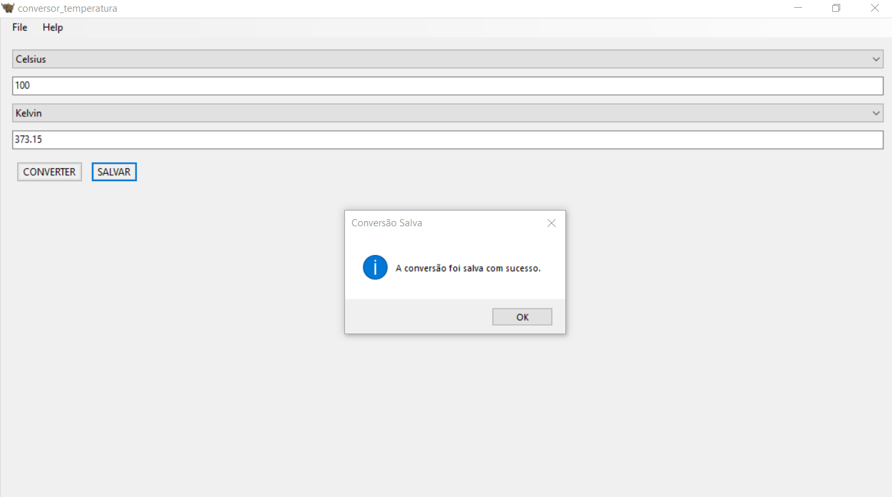
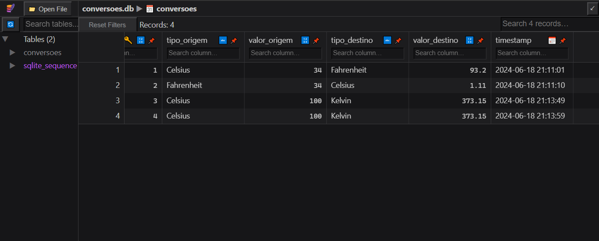

# TEMPERATURAS COM BEEWARE
👨‍🏫CONVERSOR DE TEMPERATURAS EM CELSIUS, FAHRENHEIT E KELVIN COM BEEWARE E SQLITE.

 <br>
 <br>

## DESCRIÇÃO:
O aplicativo de Conversão de Temperatura desenvolvido em Python usando a biblioteca `toga` permite aos usuários converter valores de temperatura entre diferentes unidades (Celsius, Fahrenheit e Kelvin) de forma simples e intuitiva. Além disso, o aplicativo mantém um registro das conversões realizadas em um banco de dados SQLite, proporcionando um histórico das atividades.

## FUNCIONALIDADES:
1. **Conversão de Temperatura:**
   - **Seleção de Unidades:** O usuário pode escolher entre Celsius, Fahrenheit ou Kelvin como unidades de temperatura de origem e destino.
   - **Entrada de Valores:** Insira o valor numérico da temperatura a ser convertida no campo de entrada correspondente.
   - **Botão "Converter":** Ao pressionar o botão "Converter", o aplicativo calcula e exibe o valor convertido no campo de destino, conforme a seleção das unidades.

2. **Registro de Conversões:**
   - **Salvamento de Conversões:** Após realizar uma conversão, o usuário pode optar por salvar a conversão clicando no botão "Salvar". Isso registra os detalhes da conversão (unidades de origem e destino, valores convertidos e timestamp) no banco de dados SQLite.

3. **Histórico de Conversões:**
   - **Armazenamento Permanente:** Todas as conversões são armazenadas no banco de dados, permitindo que o usuário consulte o histórico de todas as conversões feitas anteriormente.
   - **Visualização e Gerenciamento:** O histórico de conversões pode ser acessado para revisão ou para consultas posteriores, oferecendo uma visão detalhada das atividades realizadas.

## EXECUTANDO O PROJETO:
1. **Instalação:**
   - Entre no diretório `./CODIGO/temperatura_app` e execute o comando:

   ```bash
   pip install -r requirements.txt
   ```

2. **Executando o Aplicativo:**
   - Execute o aplicativo em modo de desenvolvimento utilizando o Briefcase:
     ```
     briefcase dev
     ```

3. **Interagindo com o Aplicativo:**
   - Na interface do aplicativo, selecione as unidades de temperatura de origem e destino nos menus suspensos correspondentes.
   - Insira o valor numérico da temperatura que você deseja converter no campo de entrada apropriado.
   - Clique no botão "Converter" para realizar a conversão. O resultado da conversão será exibido no campo de destino.
   - Para salvar a conversão realizada, clique no botão "Salvar". Uma mensagem de confirmação será exibida para indicar que a conversão foi registrada com sucesso no banco de dados.

4. **Acessando o Histórico de Conversões:**
   - Para revisar ou consultar as conversões previamente realizadas, você pode acessar o banco de dados diretamente `(./CODIGO/temperatura_app/src/temperatura_app/conversoes.db)` ou implementar uma funcionalidade na interface do aplicativo para listar o histórico de conversões.

## NÃO SABE?
- Entendemos que para manipular arquivos em muitas linguagens, é necessário possuir conhecimento nessas áreas. Para auxiliar nesse aprendizado, oferecemos cursos gratuitos disponíveis:
* [CURSO DE PYTHON](https://github.com/VILHALVA/CURSO-DE-PYTHON)
* [CURSO DE BEEWARE](https://github.com/VILHALVA/CURSO-DE-BEEWARE)
* [CURSO DE SQLITE](https://github.com/VILHALVA/CURSO-DE-SQLITE)
* [CURSO DE PYTHON COM SQLITE](https://github.com/VILHALVA/CURSO-DE-PYTHON-COM-SQLITE)
* [CONFIRA MAIS CURSOS](https://github.com/VILHALVA?tab=repositories&q=+topic:CURSO)

## CREDITOS:
- [PROJETO CRIADO PELO VILHALVA](https://github.com/VILHALVA)


